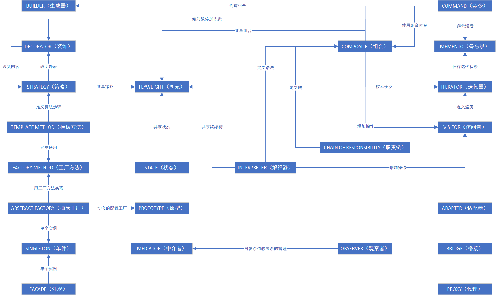

# 设计模式

> 可复用面向对象软件的基础

## 组织分类

- [x] **[创建型模式](./src/main/java/com/gof/creational)**
    - [ABSTRACT FACTORY（抽象工厂）](./src/main/java/com/gof/creational/abstract_factory)
        - 提供一个创建一系列相关或相互依赖对象的接口，而无须指定它们具体的类。
    - [BUILDER（生成器）](./src/main/java/com/gof/creational/builder)
        - 将一个复杂对象的构建与它的表示分离，使得同样的构建过程可以创建不同的表示。
    - [FACTORY METHOD（工厂方法）](./src/main/java/com/gof/creational/factory_method)
        - 定义一个用于创建对象的接口，让子类决定将哪一个类实例化。Factory Method使一个类的实例化延迟到其子类。
    - [PROTOTYPE（原型）](./src/main/java/com/gof/creational/prototype)
        - 用原型实例指定创建对象的种类，并且通过拷贝这个原型来创建新的对象。
    - [SINGLETON（单件）](./src/main/java/com/gof/creational/singleton)
        - 保证一个类仅有一个实例，并提供一个访问它的全局访问点。
- [x] **[结构型模式](./src/main/java/com/gof/structural)**
    - [ADAPTER（适配器）](./src/main/java/com/gof/structural/adapter)
        - 将一个类的接口转换成客户希望的另外一个接口。Adapter模式使得原本由于接口不兼容而不能一起工作的那些类可以一起工作。
    - [BRIDGE（桥接）](./src/main/java/com/gof/structural/bridge)
        - 将抽象部分与它的实现部分分离，使它们都可以独立地变化。
    - [COMPOSITE（组合）](./src/main/java/com/gof/structural/composite)
        - 将对象组合成树形结构以表示“部分-整体”的层次结构。Composite使得客户对单个对象和组合对象的使用具有一致性。
    - [DECORATOR（装饰）](./src/main/java/com/gof/structural/decorator)
        - 动态地给一个对象添加一些额外的职责。就扩展功能而言，Decorator模式比生成子类方式更为灵活。
    - [FACADE（外观）](./src/main/java/com/gof/structural/facade)
        - 为子系统中的一组接口提供一个一致的界面，Facade模式定义了一个高层接口，这个接口使得这一子系统更加容易使用。
    - [FLYWEIGHT（享元）](./src/main/java/com/gof/structural/flyweight)
        - 运用共享技术有效地支持大量细粒度的对象。
    - [PROXY（代理）](./src/main/java/com/gof/structural/proxy)
        - 为其他对象提供一个代理以控制对这个对象的访问。
- [x] **[行为模式](./src/main/java/com/gof/behavioral)**
    - [CHAIN OF RESPONSIBILITY（职责链）](./src/main/java/com/gof/behavioral/chain_of_responsibility)
        - 解除请求的发送者和接收者之间的耦合，使多个对象都有机会处理这个请求。将这些对象连成一条链，并沿着这条链传递该请求，直到有一个对象处理它。
    - [COMMAND（命令）](./src/main/java/com/gof/behavioral/command)
        - 将一个请求封装为一个对象，从而使你可用不同的请求对客户进行参数化；对请求排队或记录请求日志，以及支持可取消的操作。
    - [INTERPRETER（解释器）](./src/main/java/com/gof/behavioral/interpreter)
        - 给定一个语言，定义它的文法的一种表示，并定义一个解释器，该解释器使用该表示来解释语言中的句子。
    - [ITERATOR（迭代器）](./src/main/java/com/gof/behavioral/iterator)
        - 提供一种方法顺序访问一个聚合对象中的各个元素，而又不需要暴露该对象的内部表示。
    - [MEDIATOR（中介者）](./src/main/java/com/gof/behavioral/mediator)
        - 用一个中介对象来封装一系列的对象交互。中介者使各对象不需要显式地相互引用，从而使其耦合松散，而且可以独立地改变它们之间的交互。
    - [MEMENTO（备忘录）](./src/main/java/com/gof/behavioral/memento)
        - 在不破坏封装性的前提下，捕获一个对象的内部状态，并在该对象之外保存这个状态。这样以后就可将对象恢复到保存的状态。
    - [OBSERVER（观察者）](./src/main/java/com/gof/behavioral/observer)
        - 定义对象间的一种一对多的依赖关系，以便当一个对象的状态发生改变时，所有依赖于它的对象都得到通知并自动刷新。
    - [STATE（状态）](./src/main/java/com/gof/behavioral/state)
        - 允许一个对象在其内部状态改变时改变它的行为。对象看起来似乎修改了它所属的类。
    - [STRATEGY（策略）](./src/main/java/com/gof/behavioral/strategy)
        - 定义一系列的算法，把它们一个个封装起来，并且使它们可相互替换。本模式使得算法的变化可独立于使用它的客户。
    - [TEMPLATE METHOD（模板方法）](./src/main/java/com/gof/behavioral/template_method)
        - 定义一个操作中的算法的骨架，而将一些步骤延迟到子类中。Template Method使得子类不改变一个算法的结构即可重定义该算法的某些特定步骤。
    - [VISITOR（访问者）](./src/main/java/com/gof/behavioral/visitor)
        - 表示一个作用于某对象结构中的各元素的操作。它使你可以在不改变各元素的类的前提下定义作用于这些元素的新操作。

## 设计应支持变化

下面阐述了一些导致重新设计的一般原因，以及解决这些问题的设计模式：

1. **通过显式地指定一个类来创建对象**——在创建对象时指定类名将使你受特定实现的约束而不是特定接口的约束。这会使未来的变化更复杂。要避免这种情况，应该间接地创建对象。
    * 设计模式：[ABSTRACT FACTORY（抽象工厂）](./src/main/java/com/gof/creational/abstract_factory)
      、[FACTORY METHOD（工厂方法）](./src/main/java/com/gof/creational/factory_method)
      、[PROTOTYPE（原型）](./src/main/java/com/gof/creational/prototype)
1. **对特殊操作的依赖**——当你为请求指定一个特殊的操作时，完成该请求的方式就固定下来了。为避免把请求代码写死，你将可以在编译时或运行时很方便地改变响应请求的方法。
    * 设计模式：[CHAIN OF RESPONSIBILITY（职责链）](./src/main/java/com/gof/behavioral/chain_of_responsibility)
      、[COMMAND（命令）](./src/main/java/com/gof/behavioral/command)
1. **对硬件和软件平台的依赖**
   ——外部的操作系统接口和应用编程接口（API）在不同的软硬件平台上是不同的。依赖于特定平台的软件将很难移植到其他平台上，甚至很难跟上本地平台的更新。所以设计系统时限制其平台相关性就很重要了。
    * 设计模式：[ABSTRACT FACTORY（抽象工厂）](./src/main/java/com/gof/creational/abstract_factory)
      、[BRIDGE（桥接）](./src/main/java/com/gof/structural/bridge)
1. **对对象表示或实现的依赖**——知道对象怎么表示、保存、定位或实现的客户在对象发生变化时可能也需要变化。对客户隐藏这些信息能阻止连锁变化。
    * 设计模式：[ABSTRACT FACTORY（抽象工厂）](./src/main/java/com/gof/creational/abstract_factory)
      、[BRIDGE（桥接）](./src/main/java/com/gof/structural/bridge)
      、[MEMENTO（备忘录）](./src/main/java/com/gof/behavioral/memento)
      、[PROXY（代理）](./src/main/java/com/gof/structural/proxy)
1. **算法依赖**——算法在开发和复用时常常被扩展、优化和替代。依赖于某个特定算法的对象在算法发生变化时不得不变化。因此有可能发生变化的算法应该被孤立起来。
    * 设计模式：[BUILDER（生成器）](./src/main/java/com/gof/creational/builder)
      、[ITERATOR（迭代器）](./src/main/java/com/gof/behavioral/iterator)
      、[STRATEGY（策略）](./src/main/java/com/gof/behavioral/strategy)
      、[TEMPLATE METHOD（模板方法）](./src/main/java/com/gof/behavioral/template_method)
      、[VISITOR（访问者）](./src/main/java/com/gof/behavioral/visitor)
1. **紧耦合**——紧耦合的类很难独立地被复用，因为它们是互相依赖的。紧耦合产生单块的系统，要改变或删掉一个类，你必须理解和改变其他许多类。这样的系统是一个很难学习、移植和维护的密集体。
    
   松散耦合提高了一个类本身被复用的可能性，并且系统更易于学习、移植、修改和扩展。设计模式使用抽象耦合和分层技术来提高系统的松散耦合性。
    * 设计模式：[ABSTRACT FACTORY（抽象工厂）](./src/main/java/com/gof/creational/abstract_factory)
      、[COMMAND（命令）](./src/main/java/com/gof/behavioral/command)
      、[FACADE（外观）](./src/main/java/com/gof/structural/facade)
      、[MEDIATOR（中介者）](./src/main/java/com/gof/behavioral/mediator)
      、[OBSERVER（观察者）](./src/main/java/com/gof/behavioral/observer)
      、[CHAIN OF RESPONSIBILITY（职责链）](./src/main/java/com/gof/behavioral/chain_of_responsibility)
1. **通过生成子类来扩充功能**
   ——通常很难通过定义子类来定制对象。每一个新类都有固定的实现开销（初始化、终止处理等）。定义子类还需要对父类有深入的了解。如，重定义一个操作可能需要重定义其他操作。一个被重定义的操作可能需要调用继承下来的操作。并且子类方法会导致类爆炸，因为即使对于一个简单的扩充，你也不得不引入许多新的子类。
    
   一般的对象组合技术和具体的委托技术，是继承之外组合对象行为的另一种灵活方法。新的功能可以通过以新的方式组合已有对象，而不是通过定义已存在类的子类的方式加到应用中去。另一方面，过多使用对象组合会使设计难于理解。许多设计模式产生的设计中，可以定义一个子类，且将它的实例和已存在实例进行组合来引入定制的功能。
    * 设计模式：[BRIDGE（桥接）](./src/main/java/com/gof/structural/bridge)
      、[CHAIN OF RESPONSIBILITY（职责链）](./src/main/java/com/gof/behavioral/chain_of_responsibility)
      、[COMPOSITE（组合）](./src/main/java/com/gof/structural/composite)
      、[DECORATOR（装饰）](./src/main/java/com/gof/structural/decorator)
      、[OBSERVER（观察者）](./src/main/java/com/gof/behavioral/observer)
      、[STRATEGY（策略）](./src/main/java/com/gof/behavioral/strategy)
1. **不能方便地对类进行修改**
   ——有时你不得不改变一个难以修改的类。也许你需要源代码而又没有（对于商业类库就有这种情况），或者可能对类的任何改变会要求修改许多已存在的其他子类。设计模式提供在这些情况下对类进行修改的方法。
    * 设计模式：[ADAPTER（适配器）](./src/main/java/com/gof/structural/adapter)
      、[DECORATOR（装饰）](./src/main/java/com/gof/structural/decorator)
      、[VISITOR（访问者）](./src/main/java/com/gof/behavioral/visitor)

## 设计的可变方面

考虑你的设计中哪些是可变的，这个方法与关注引起重新设计的原因刚好相反。它不是考虑什么会迫使你的设计改变，而是考虑你想要什么变化却又不会引起重新设计。最主要的一点是封装变化的概念，这是许多设计模式的主题。下表列出了设计模式允许你独立变化的方面，你可以改变它们而又不会导致重新设计。

| 目的  | 设计模式                                                                                       | 可变的方面                           |
|:---:|:-------------------------------------------------------------------------------------------|:--------------------------------|
| 创建  | [ABSTRACT FACTORY（抽象工厂）](./src/main/java/com/gof/creational/abstract_factory)              | 产品对象家族                          |
|     | [BUILDER（生成器）](./src/main/java/com/gof/creational/builder)                                 | 如何创建一个组合对象                      |
|     | [FACTORY METHOD（工厂方法）](./src/main/java/com/gof/creational/factory_method)                  | 被实例化的子类                         |
|     | [PROTOTYPE（原型）](./src/main/java/com/gof/creational/prototype)                              | 被实例化的类                          |
|     | [SINGLETON（单件）](./src/main/java/com/gof/creational/singleton)                              | 一个类的唯一实例                        |
| 结构  | [ADAPTER（适配器）](./src/main/java/com/gof/structural/adapter)                                 | 对象的接口                           |
|     | [BRIDGE（桥接）](./src/main/java/com/gof/structural/bridge)                                    | 对象的实现                           |
|     | [COMPOSITE（组合）](./src/main/java/com/gof/structural/composite)                              | 一个对象的结构和组成                      |
|     | [DECORATOR（装饰）](./src/main/java/com/gof/structural/decorator)                              | 对象的职责，不生成子类                     |
|     | [FACADE（外观）](./src/main/java/com/gof/structural/facade)                                    | 一个子系统的接口                        |
|     | [FLYWEIGHT（享元）](./src/main/java/com/gof/structural/flyweight)                              | 对象的存储开销                         |
|     | [PROXY（代理）](./src/main/java/com/gof/structural/proxy)                                      | 如何访问一个对象；该对象的位置                 |
| 行为  | [CHAIN OF RESPONSIBILITY（职责链）](./src/main/java/com/gof/behavioral/chain_of_responsibility) | 满足一个请求的对象                       |
|     | [COMMAND（命令）](./src/main/java/com/gof/behavioral/command)                                  | 何时、怎么满足一个请求                     |
|     | [INTERPRETER（解释器）](./src/main/java/com/gof/behavioral/interpreter)                         | 一个语言的文法及解释                      |
|     | [ITERATOR（迭代器）](./src/main/java/com/gof/behavioral/iterator)                               | 如何遍历、访问一个聚合的各元素                 |
|     | [MEDIATOR（中介者）](./src/main/java/com/gof/behavioral/mediator)                               | 对象间怎么交互、和谁交互                    |
|     | [MEMENTO（备忘录）](./src/main/java/com/gof/behavioral/memento)                                 | 一个对象中哪些私有信息存放在该对象之外，以及在什么时候进行存储 |
|     | [OBSERVER（观察者）](./src/main/java/com/gof/behavioral/observer)                               | 多个对象依赖于另外一个对象，而这些对象又如何保存一致      |
|     | [STATE（状态）](./src/main/java/com/gof/behavioral/state)                                      | 对象的状态                           |
|     | [STRATEGY（策略）](./src/main/java/com/gof/behavioral/strategy)                                | 算法                              |
|     | [TEMPLATE METHOD（模板方法）](./src/main/java/com/gof/behavioral/template_method)                | 算法中的某些步骤                        |
|     | [VISITOR（访问者）](./src/main/java/com/gof/behavioral/visitor)                                 | 某些可作用于一个（组）对象上的操作，但不修改这些对象的类    |

## 附录

- [图示符号指南](./appendix/OMT.md)
