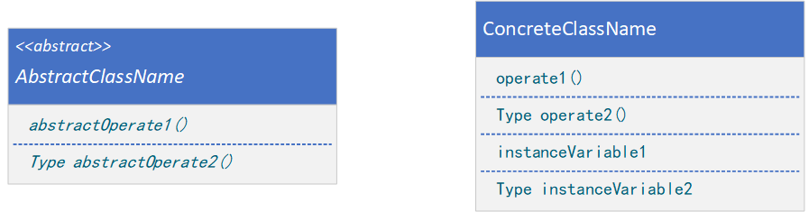
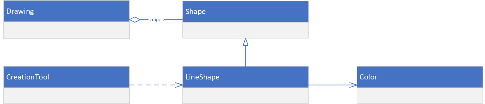
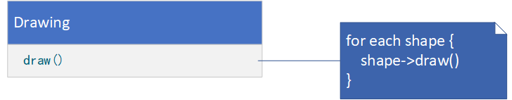
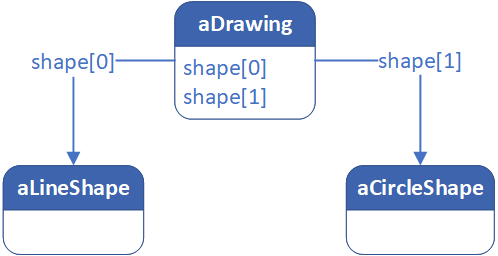
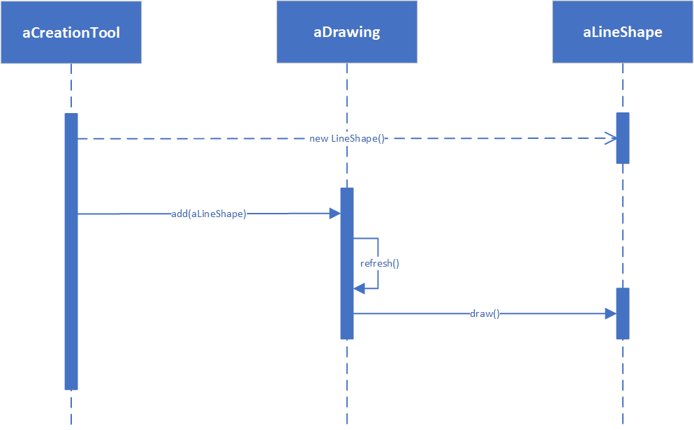

# 附录：图示符号指南

> Object Modeling Technique

特别地，设计模式使用较为正式的图形符号以显示类和对象间的关系和交互。我们使用了三种不同的图形符号：

1. **类图**描述各个类、它们的结构以及它们之间的静态关系。
2. **对象图**描述运行时特定的对象结构。
3. **交互图**展示对象间请求的流程。

每个设计模式至少包含一个类图，需要时也使用其他图形表示来补充说明。类图和对象图是基于OMT（Object Modeling
Technique）的。交互图来自于Objectory和Booch方法。

## 类图

上图是以OMT符号表示的抽象类和具体类。一个类表示为一个线框，在顶部以粗体写着类名，其下是主要的操作，再下是实例变量。类型信息是可选的。我们使用C++的书写习惯，将类型名置于操作名（强调返回类型）、变量名或参数之前。斜体表示该类或操作是抽象的。

在某些设计模式中，标清楚客户类对参与类的引用是很有用的。在类图中，当某个客户类是某模式的参与者（即该客户类在这个模式中承担一定的责任）时，我们以正常的方式表示它，可以参见Flyweight；而当该客户不是该模式的参与者（即客户类在模式中不承担责任），仅仅是为了说明其与模式的参与者之间的交互关系时，我们以灰色来表示它。如上图所示。代理模式（Proxy）就是一个例子。这种灰客户表示法也提醒我们在讨论模式参与者时不要漏掉客户类。

上图展示了类间的几种关系。在OMT表示法中，类继承表示为一个从子类（图中的LineShape）到父类（图中的Shape）的三角形连线；代表部分或聚集关系的对象引用表示为一个根部有菱形的箭头，指向被聚集的类（图中的Shape）；根部没有菱形的箭头表示相识关系（图中LineShape有一个指向Color的引用，而Color可能是多个Shape对象共享的）。在箭头根部附近可以注明引用的名称，以区别于其他引用。

另一个有用的表示是说明哪个类创建哪个类的对象。由于OMT不支持这种表示，所有我们用虚线箭头来标记这种情况。我们称之为“创建”关系。箭头指向的是被实例化的对象。在上图中，CreationTool创建LineShape对象。

OMT还定义了一种实心圆点，表示“多于一个”。当圆点位于引用的头部时，它表示指向或聚集多个对象。上图中Drawing聚集了多个Shape类型的对象。

最后，我们认为可以在OMT图上加上一些伪代码，以简要说明操作的实现。上图中的伪代码说明了Drawing类的Draw操作的实现。

## 对象图

对象图仅仅描述实例。它描述了设计模式中的对象某个时刻的状况。对象的名字通常表示为“aSomething”，其中Something是该对象的类。我们用来表示对象的符号（对标准OMT稍作修改）是一个圆角矩形，并以一条直线将对象名与对象引用分开。箭头表示对象引用。如上图所示。

## 交互图

交互图展示了对象间各请求的执行顺序。上图就是一个交互图，它描述了一个Shape对象是如何加入某个Drawing对象中去的。

交互图中从上到下表示时间流向。一条垂直实线表示一个特定对象的生命周期。对象的命名规则与对象图一样，即在类名前加一个“a”（例如aShape）。如果某对象在本图所示的时间区间开始时还未被创建，则用垂直虚线表示，这条虚线一直延伸到它被创建的时间点。

一个垂直的矩形表示对象在活动，也就是说它正在处理某个请求。在操作过程中也可以向其他对象发出请求，这以一个指向接收对象的水平箭头表示。请求的名称标注在箭头上方。创建对象的请求以虚线箭头表示。一个发给自身的请求也指向发送者自身。

在上图中，第一个请求是aCreationTool发出的，请求创建aLineShape。接下来，aLineShape被加入到aDrawing中，这导致aDrawing向它自身发出一个Refresh请求。而在Refresh操作过程中aDrawing又向aLineShape发出一个Draw请求。
