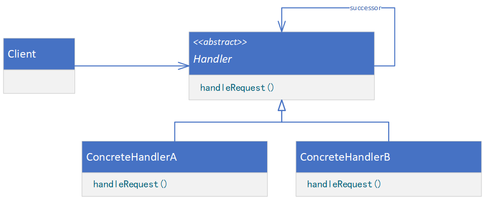
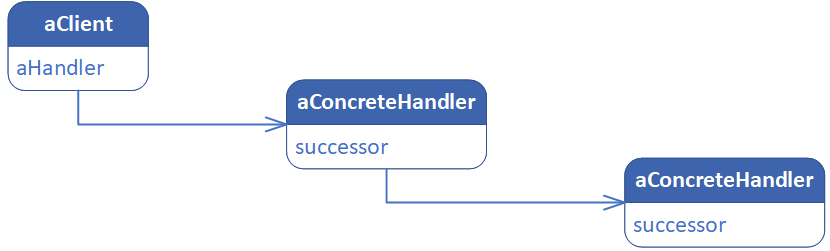
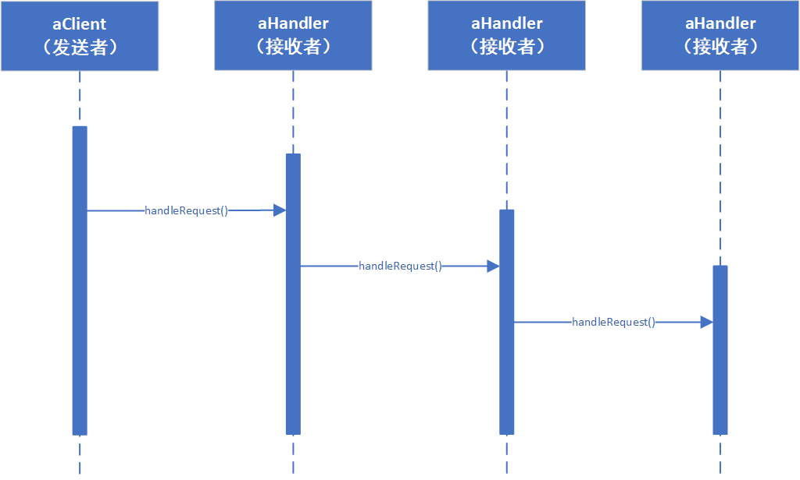

**CHAIN OF RESPONSIBILITY（职责链）**

# 意图

使多个对象都有机会处理请求，从而避免请求的发送者和接收者之间的耦合关系。将这些对象连成一条链，并沿着这条链传递该请求，直到有一个对象处理它为止。

# 适用性

在以下条件时使用Chain of Responsibility链：

* 有多个的对象可以处理一个请求，哪个对象处理该请求运行时自动确定。
* 你想在不明确指定接收者的情况下，向多个对象中的一个提交一个请求。
* 可处理一个请求的对象集合应被动态指定。

# 结构



一个典型的对象结构可能如下图所示：



# 参与者

* Handler（如HelpHandler）
    * 定义一个处理请求的接口。
    * （可选）实现后继链。
* ConcreteHandler（如PrintButton和PrintDialog）
    * 处理它所负责的请求。
    * 可访问它的后继者。
    * 如果可处理该请求，就处理之；否则将该请求转发给它的后继者。
* Client
    * 向链上的具体处理器（ConcreteHandler）对象提交请求。

# 协作

* 当客户提交一个请求时，请求沿链传递直至有一个ConcreteHandler对象负责处理它。



# 代码示例

```java
public abstract class Handler {
    private Handler successor;

    public Handler(Handler successor) {
        this.successor = successor;
    }

    public void handleRequest() {
        if (this.successor != null) {
            this.successor.handleRequest();
        }
    }
}
```

```java
public class ConcreteHandler extends Handler {
    private boolean state;

    public ConcreteHandler(Handler successor) {
        super(successor);
    }

    @Override
    public void handleRequest() {
        if (this.canHandle()) {
            // provide processing logic
        } else {
            super.handleRequest();
        }
    }

    public void setState(boolean state) {
        this.state = state;
    }

    private boolean canHandle() {
        // determine whether it can be handled
        return this.state;
    }
}
```

```java
public class Client {
    public static void main(String[] args) {
        ConcreteHandler handlerA = new ConcreteHandler(null);
        ConcreteHandler handlerB = new ConcreteHandler(handlerA);
        handlerA.setState(true);
        handlerB.setState(false);
        Handler rootHandler = handlerB;
        rootHandler.handleRequest();
    }
}
```