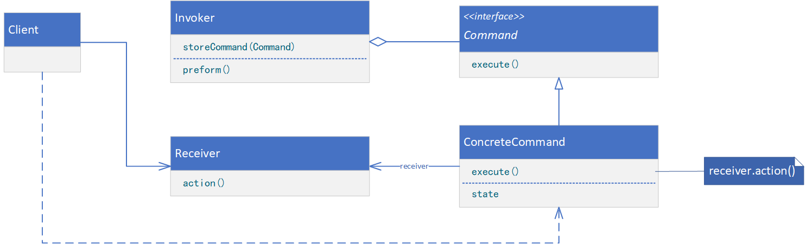
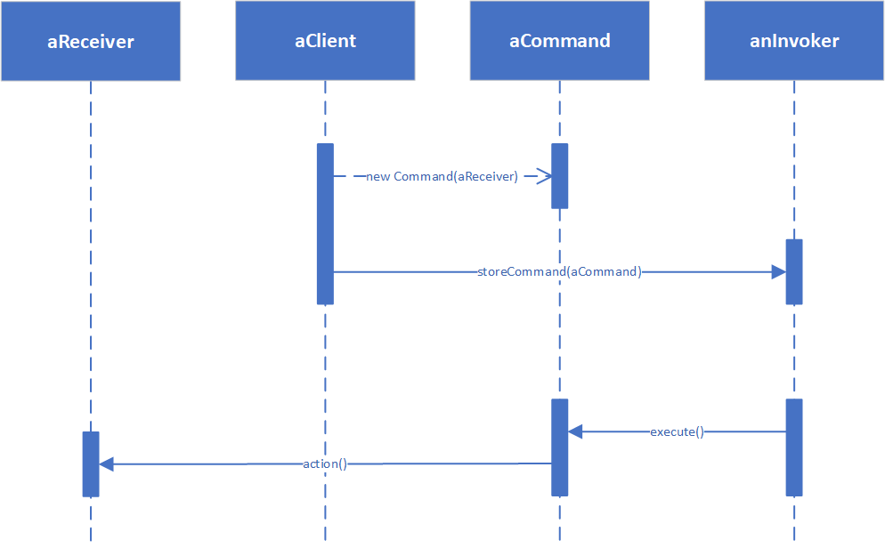

**COMMAND（命令）**

# 意图

将一个请求封装为一个对象，从而使你可用不同的请求对客户进行参数化；对请求排队或记录请求日志，以及支持可撤销的操作。

# 别名

动作（Action），事务（Transaction）

# 适用性

当你有如下需求时，可使用Command模式：

* 像上面讨论的MenuItem对象那样，抽象出待执行的动作以参数化某对象。你可用过程语言中的回调（Callback）函数表达这种参数化机制。所谓回调函数是指函数先在某处注册，而它将在稍后某个需要的时候被调用。Command模式是回调机制的一个面向对象的替代品。
* 在不同的时刻指定、排列和执行请求。一个Command对象可以有一个与初始请求无关的生存期。如果一个请求的接收者可用一种与地址空间无关的方式表达，那么就可将负责该请求的命令对象传送给另一个不同的进程并在那里实现该请求。
* 支持取消操作。Command的Execute操作可在实施操作前将状态存储起来，在取消操作时这个状态用来取消该操作的影响。Command接口必须添加一个Unexecute操作，该操作取消上一次Execute调用的效果。执行的命令被存储在一个历史列表中。可通过向后和向前遍历这一列表并分别调用Unexecute和Execute来实现重数不限的”撤销“和”重做“。
* 支持修改日志，这样当系统崩溃时，这些修改可以被重做一遍。在Command接口中添加装载操作和存储操作，可以用来保持一个一致的修改日志。从崩溃中恢复的过程包括从磁盘中重新读入记录下来的命令并用Execute操作重新执行它们。
* 用构建在原语操作上的高层操作构造一个系统。这样一种结构在支持事务（Transaction）的信息系统中很常见。一个事务封装了对数据的一组变动。Command模式提供了对事务进行建模的方法。Command有一个公共的接口，使得你可以用同一种方式调用所有的事务。同时使用该模式也易于添加新事务以扩展系统。

# 结构



# 参与者

* Command
    * 声明执行操作的接口。
* ConcreteCommand（PasteCommand、OpenCommand）
    * 将一个接收者对象绑定于一个动作。
    * 调用接收者相应的操作，以实现Execute。
* Client（Application）
    * 创建一个具体命令对象并设定它的接收者。
* Invoker（MenuItem）
    * 要求该命令执行这个请求。
* Receiver（Document、Application）
    * 知道如何实施与执行一个请求相关的操作。任何类都可能作为一个接收者。

# 协作

* Client创建一个ConcreteCommand对象并指定它的Receiver对象。
* 某Invoker对象存储该ConcreteCommand对象。
* 该Invoker通过调用Command对象的Execute操作来提交一个请求。若该命令是可撤销的，ConcreteCommand就在执行Execute操作之前存储当前状态以用于取消该命令。
* ConcreteCommand对象调用它的Receiver的一些操作以执行该请求。

下图展示了这些对象之间的交互。它说明了Command是如何将调用者和接收者（以及它执行的请求）解耦的。



# 代码示例

```java
public interface Command {
    void execute();
}
```

```java
public class ConcreteCommand implements Command {
    private Receiver receiver;

    public ConcreteCommand(Receiver receiver) {
        this.receiver = receiver;
    }

    @Override
    public void execute() {
        this.receiver.action();
    }
}
```

```java
public class Receiver {
    public void action() {
        // provide processing logic
    }
}
```

```java
public class Invoker {
    private List<Command> commands;

    private Invoker() {
        this.commands = new LinkedList<>();
    }

    public void storeCommand(Command command) {
        this.commands.add(command);
    }

    public void preform() {
        this.commands.stream().forEach(command -> command.execute());
    }
}
```

```java
public class Client {
    public static void main(String[] args) {
        Invoker invoker = new Invoker();
        Receiver receiver = new Receiver();
        Command command = new ConcreteCommand(receiver);
        invoker.storeCommand(command);
        invoker.preform();
    }
}
```