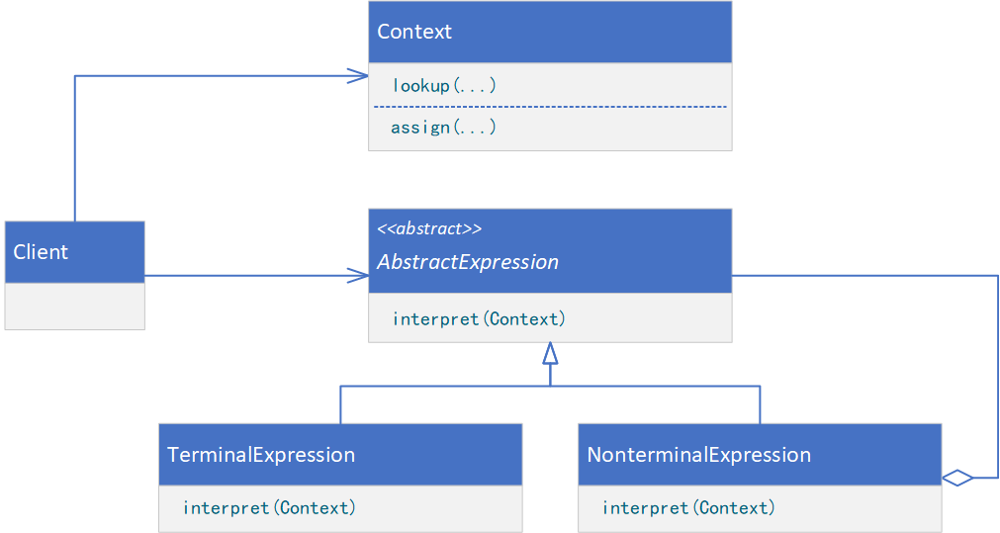
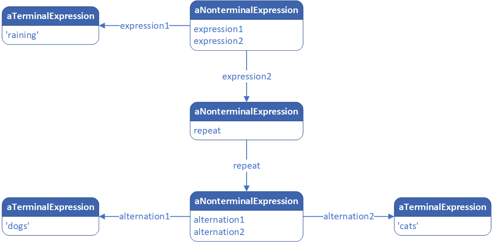

**INTERPRETER（解释器）**

# 意图

给定一个语言，定义它的文法的一种表示，并定义一个解释器，这个解释器使用该表示来解释语言中的句子。

# 适用性

当有一个语言需要解释执行，并且你可将该语言中的句子表示为一个抽象语法树时，可使用解释器模式。而当存在以下情况时该模式效果最好：

* 文法简单。对于复杂的文法，文法的类层次变得庞大而无法管理。此时语法分析程序生成器这样的工具是更好的选择。它们无须构建抽象语法树即可解释表达式，这样可以节省空间而且还可能节省时间。
* 效率不是关键问题。最高效的解释器通常不是通过直接解释语法分析树实现的，而是首先将它们转换成另一种形式。例如，正则表达式通常被转换成状态机。但即使在这种情况下，转换器也可用解释器模式实现，该模式仍是有用的。

# 结构



一个正则表达式“raining & (dogs | cats) *”的对象结构可能如下图所示：



# 参与者

* AbstractExpression（抽象表达式，如RegularExpression）
    * 声明一个抽象的解释操作，这个接口为抽象语法树中所有的结点所共享。
* TerminalExpression（终结符表达式，如LiteralExpression）
    * 实现与文法中的终结符相关联的解释操作。
    * 一个句子中的每个终结符需要该类的一个实例。
* NonterminalExpression（非终结符表达式，如AlternationExpression、RepetitionExpression、SequenceExpression）
    * 对文法中的每一条规则R::=R<sub>1</sub>R<sub>2</sub>...R<sub>n</sub>都需要一个NonterminalExpression类。
    * 为从R<sub>1</sub>到R<sub>n</sub>的每个符号都维护一个AbstractExpression类型的实例变量。
    * 为文法中的非终结符实现解释（Interpret）操作。解释（Interpret）一般要递归地调用标识R<sub>1</sub>到R<sub>n</sub>
      的那些对象的解释操作。
* Context（上下文）
    * 包含解释器之外的一些全局信息。
* Client（客户）
    * 构建（或被给定）表示该文法定义的语言中一个特定的句子的抽象语法树。该抽象语法树由NonterminalExpression和TerminalExpression的实例装配而成。
    * 调用解释操作。

# 协作

* Client构建（或被给定）一个句子，它是NonterminalExpression和TerminalExpression的实例的一个抽象语法树。然后初始化上下文并调用解释操作。
* 每一非终结符表达式结点定义相应子表达式的解释操作。而各终结符表达式的解释操作构成了递归的基础。
* 每一结点的解释操作用上下文来存储和访问解释器的状态。

# 代码示例

```java
public abstract class AbstractExpression {
    public abstract boolean interpret(Context context);
}
```

```java
public class TerminalExpression extends AbstractExpression {
    private String key;

    public TerminalExpression(String key) {
        this.key = key;
    }

    @Override
    public boolean interpret(Context context) {
        return context.lookup(key);
    }
}
```

```java
public class NonterminalExpression extends AbstractExpression {
    private AbstractExpression expressionA;

    private AbstractExpression expressionB;

    private String relationship;

    public NonterminalExpression(AbstractExpression expressionA, AbstractExpression expressionB, String relationship) {
        this.expressionA = expressionA;
        this.expressionB = expressionB;
        this.relationship = relationship;
    }

    @Override
    public boolean interpret(Context context) {
        // provide processing logic
        return false;
    }
}
```

```java
public class Context {
    public boolean lookup(String key) {
        // find the value corresponding to the key
        return false;
    }

    public void assign(String key, boolean value) {
        // the value corresponding to the specified key
    }
}
```

```java
public class Client {
    public static void main(String[] args) {
        Context context = new Context();
        context.assign("A", true);
        context.assign("B", false);
        context.assign("C", true);
        TerminalExpression terminalExpressionA = new TerminalExpression("A");
        TerminalExpression terminalExpressionB = new TerminalExpression("B");
        TerminalExpression terminalExpressionC = new TerminalExpression("C");
        NonterminalExpression nonterminalExpressionOr = new NonterminalExpression(
                terminalExpressionB, terminalExpressionC, "||"
        );
        NonterminalExpression nonterminalExpressionAnd = new NonterminalExpression(
                terminalExpressionA, nonterminalExpressionOr, "&&"
        );
        nonterminalExpressionAnd.interpret(context);
    }
}
```
