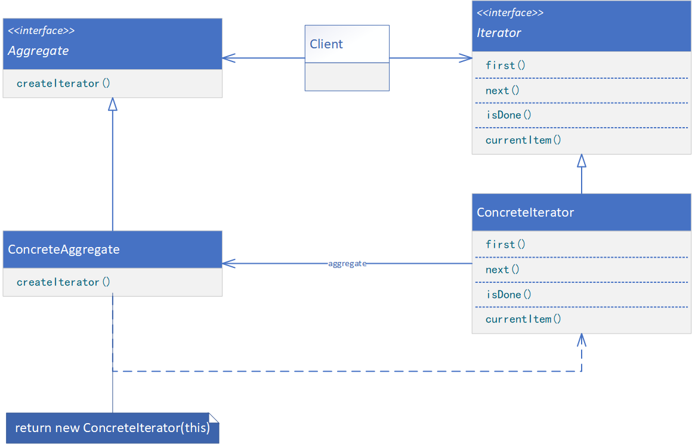

**ITERATOR（迭代器）**

# 意图

提供一种方法顺序访问一个聚合对象中的各个元素，而又不需要暴露该对象的内部表示。

# 别名

游标（Cursor）

# 适用性

在以下情况时可使用迭代器模式：

* 访问一个聚合对象的内容而无须暴露它的内部表示。
* 支持对聚合对象的多种遍历。
* 为遍历不同的聚合结构提供一个统一的接口（即支持多态迭代）。

# 结构



# 参与者

* Iterator（迭代器）
    * 迭代器定义访问和遍历元素的接口。
* ConcreteIterator（具体迭代器）
    * 具体迭代器实现迭代器接口。
    * 对该聚合遍历时跟踪当前位置。
* Aggregate（聚合）
    * 聚合定义创建相应迭代器对象的接口。
* ConcreteAggregate（具体聚合）
    * 具体聚合实现创建相应迭代器的接口，该操作返回ConcreteIterator的一个适当的实例。

# 协作

* ConcreteIterator跟踪聚合中的当前对象，并能够计算出待遍历的后继对象。

# 代码示例

```java
public interface Aggregate<T> {
    Iterator<T> createIterator();
}
```

```java
public class ConcreteAggregate<T> implements Aggregate<T> {
    T[] data;

    public ConcreteAggregate(T[] data) {
        this.data = data;
    }

    @Override
    public Iterator<T> createIterator() {
        return new ConcreteIterator<>(this);
    }
}
```

```java
public interface Iterator<T> {
    void first();

    void next();

    boolean isDone();

    T currentItem();
}
```

```java
public class ConcreteIterator<T> implements Iterator<T> {
    private ConcreteAggregate<T> aggregate;

    private int index;

    public ConcreteIterator(ConcreteAggregate<T> aggregate) {
        this.aggregate = aggregate;
        this.index = -1;
    }

    @Override
    public void first() {
        this.index = 0;
    }

    @Override
    public void next() {
        this.index++;
    }

    @Override
    public boolean isDone() {
        return this.index < this.aggregate.data.length;
    }

    @Override
    public T currentItem() {
        return this.aggregate.data[this.index];
    }
}
```

```java
public class Client {
    public static void main(String[] args) {
        String[] data = {"A", "B", "C", "D", "E", "F", "G"};
        Aggregate<String> aggregate = new ConcreteAggregate<>(data);
        Iterator<String> iterator = aggregate.createIterator();
        for (iterator.first(); iterator.isDone(); iterator.next()) {
            // provide processing logic
        }
    }
}
```
