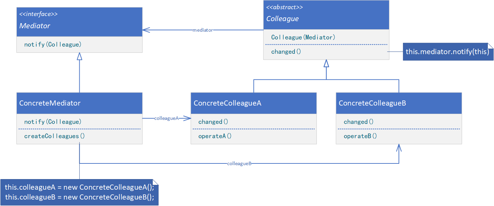
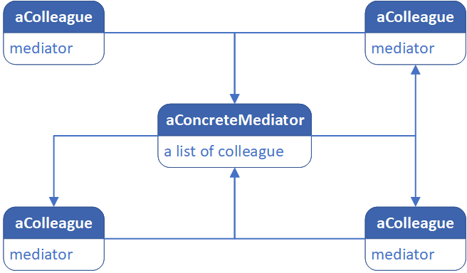
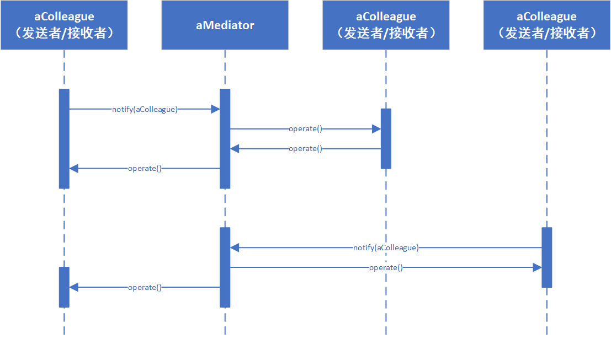

**MEDIATOR（中介者）**

# 意图

用一个中介对象来封装一系列的对象交互。中介者使各对象不需要显式地相互引用，从而使其耦合松散，而且可以独立地改变它们之间的交互。

# 适用性

在下列情况时使用中介者模式：

* 一组对象以定义良好但是复杂的方式进行通信，产生的相互依赖关系结构混乱且难以理解。
* 一个对象引用其他很多对象并且直接与这些对象通信，导致难以复用该对象。
* 想定制一个分布在多个类中的行为，而又不想生成太多的子类。

# 结构



一个典型的对象结构可能如下图所示：



# 参与者

* Mediator（中介者，如DialogDirector）
    * 中介者定义一个接口用于与各同事（Colleague）对象通信。
* ConcreteMediator（具体中介者，如FontDialogDirector）
    * 具体中介者通过协调各同事对象实现协作行为。
    * 了解并维护它的各个同事。
* ConcreteColleague（同事类，如ListBox、EntryField）
    * 每一个同事类都知道它的中介者对象。
    * 每一个同事对象在需要与其他同事通信的时候，与它的中介者通信。

# 协作

* 同事向一个中介者对象发送和接收请求。中介者在各同事间适当地转发请求以实现协作行为。



# 代码示例

```java
public abstract class Colleague {
    private Mediator mediator;

    public Colleague(Mediator mediator) {
        this.mediator = mediator;
    }

    public void changed() {
        this.mediator.notify(this);
    }
}
```

```java
public class ConcreteColleague extends Colleague {
    public ConcreteColleague(Mediator mediator) {
        super(mediator);
    }

    public void operate() {
        // provide processing logic
    }
}
```

```java
public interface Mediator {
    void notify(Colleague colleague);
}
```

```java
public class ConcreteMediator implements Mediator {
    private ConcreteColleague colleagueA;

    private ConcreteColleague colleagueB;

    public void createColleagues() {
        this.colleagueA = new ConcreteColleague(this);
        this.colleagueB = new ConcreteColleague(this);
    }

    public void triggerColleagueA() {
        this.colleagueA.changed();
    }

    public void triggerColleagueB() {
        this.colleagueB.changed();
    }

    @Override
    public void notify(Colleague colleague) {
        // provide cooperative logic
    }
}
```

```java
public class Client {
    public static void main(String[] args) {
        ConcreteMediator mediator = new ConcreteMediator();
        mediator.createColleagues();
        mediator.triggerColleagueA();
        mediator.triggerColleagueB();
    }
}
```
