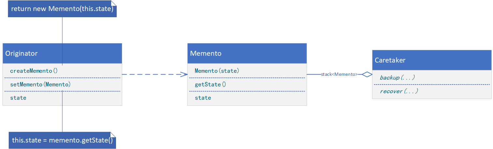
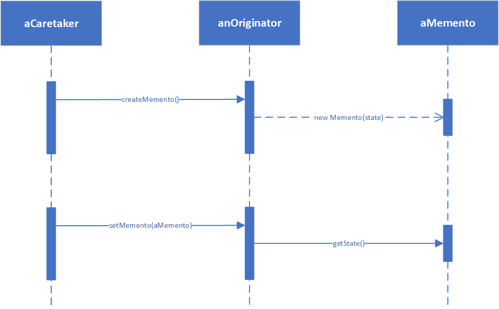

**MEMENTO（备忘录）**

# 意图

在不破坏封装性的前提下，捕获一个对象的内部状态，并在该对象之外保存这个状态。这样以后就可将该对象恢复到原先保存的状态。

# 别名

Token

# 适用性

在以下情况时使用备忘录模式：

* 必须保存一个对象在某一个时刻的（部分）状态，这样以后需要时它才能恢复到先前的状态。
* 如果一个接口让其它对象直接得到这些状态，将会暴露对象的实现细节并破坏对象的封装性。

# 结构



# 参与者

* Memento（备忘录，如SolverState）
    * 备忘录存储原发器对象的内部状态。原发器根据需要决定备忘录存储原发器的哪些内部状态。
    * 防止原发器以外的其他对象访问备忘录。备忘录实际上有两个接口，管理者（Caretaker）只能看到备忘录的窄接口——它只能将备忘录传递给其他对象。相反，原发器能够看到一个宽接口，允许它访问返回到先前状态所需的所有数据。理想的情况是只允许生成本备忘录的那个原发器访问本备忘录的内部状态。
* Originator（原发器，如ConstraintSolver）
    * 原发器创建一个备忘录，用以记录当前时刻它的内部状态。
    * 使用备忘录恢复内部状态。
* Caretaker（负责人，如undo mechanism）
    * 负责保存好备忘录。
    * 不能对备忘录的内容进行操作或检查。

# 协作

* 管理器向原发器请求一个备忘录，保留一段时间后，将其送回给原发器，如下面的交互图所示。有时管理者不会将备忘录返回给原发器，因为原发器可能根本不需要退到先前的状态。
* 备忘录是被动的。只有创建备忘录的原发器会对它的状态进行赋值和检索。



# 代码示例

```java
public class Memento {
    private String state;

    public Memento(String state) {
        this.state = state;
    }

    String getState() {
        return this.state;
    }
}
```

```java
public class Originator {
    private String state;

    public Memento createMemento() {
        return new Memento(this.state);
    }

    public void setMemento(Memento memento) {
        this.state = memento.getState();
    }
}
```

```java
public class Caretaker {
    private Deque<Memento> stack;

    private Caretaker() {
        this.stack = new ArrayDeque<>();
    }

    public void backup(Originator originator) {
        Memento memento = originator.createMemento();
        this.stack.push(memento);
    }

    public void recover(Originator originator) {
        Memento memento = this.stack.pop();
        originator.setMemento(memento);
    }
}
```

```java
public class Client {
    public static void main(String[] args) {
        Caretaker caretaker = new Caretaker();
        Originator originator = new Originator();
        // provide processing logic
        caretaker.backup(originator);
        // provide processing logic
        caretaker.recover(originator);
        // provide processing logic
    }
}
```
