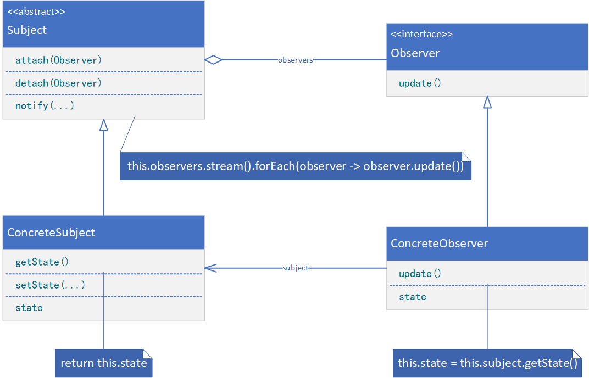
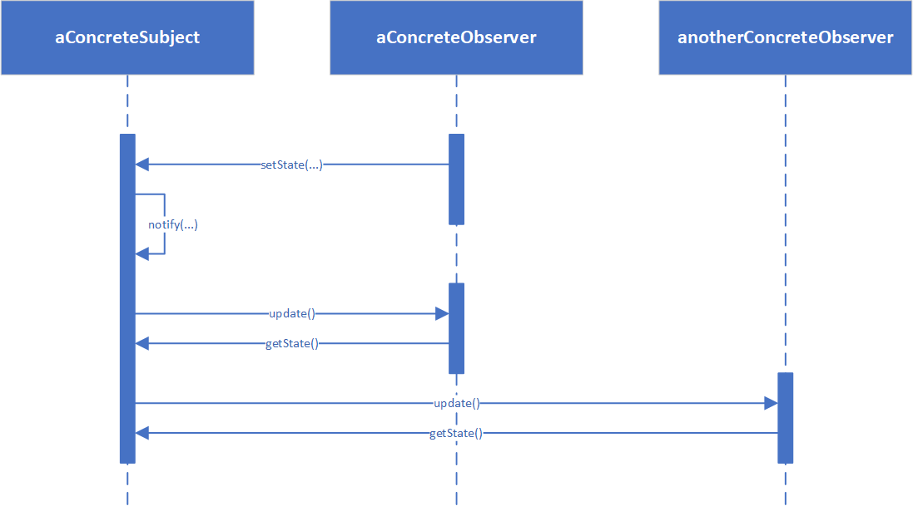

**OBSERVER（观察者）**

# 意图

定义对象间的一种一对多的依赖关系，当一个对象的状态发生改变时，所有依赖于它的对象都得到通知并被自动更新。

# 别名

依赖（Dependents），发布-订阅（Publish-Subscribe）

# 适用性

在以下情况时可以使用观察者模式：

* 一个抽象模型有两个方面，其中一个方面依赖于另一个方面。将这二者封装在独立的对象中，以使它们可以各自独立地改变和复用。
* 对一个对象的改变需要同时改变其它对象，而不知道具体有多少对象有待改变。
* 一个对象必须通知其它对象，而它又不能假定其它对象是谁。换言之，你不希望这些对象是紧密耦合的。

# 结构



# 参与者

* Subject（目标）
    * 目标知道它的观察者。可以有任意多个观察者观察同一个目标。
    * 提供注册和删除观察者对象的接口。
* Observer（观察者）
    * 为那些在目标发生改变时需要获得通知的对象定义一个更新接口。
* ConcreteSubject（具体目标）
    * 将有关状态存入各ConcreteObserver对象。
    * 当它的状态发生改变时，向其各个观察者发出通知。
* ConcreteObserver（具体观察者）
    * 维护一个指向ConcreteSubject对象的引用。
    * 存储有关状态，这些状态应与目标的状态保存一致。
    * 实现Observer的更新接口，以使自身状态与目标的状态保持一致。

# 协作

* 当ConcreteSubject发生任何可能导致其观察者与其本身状态不一致的改变时，它将通知它的各个观察者。
* 在得到一个具体目标的改变通知后，ConcreteObserver对象可向目标对象查询信息。ConcreteObserver使用这些信息使它的状态与目标对象的状态一致。

下面的交互图说明了一个目标对象和两个观察者之间的协作：



注意发出改变请求的Observer对象并不立即更新，而是将其推迟到它从目标得到一个通知之后。Notify不总是由目标对象调用。它也可被一个观察者或其他对象调用。

# 代码示例

```java
public interface Observer {
    void update();
}
```

```java
public class ConcreteObserver implements Observer {
    private Subject subject;

    private String state;

    public ConcreteObserver(Subject subject) {
        this.subject = subject;
        this.state = null;
    }

    @Override
    public void update() {
        this.state = this.subject.getState();
    }

    public void changeSubjectState(String state) {
        this.subject.setState(state);
    }

    public String getState() {
        return this.state;
    }
}
```

```java
public abstract class Subject {
    private List<Observer> observers;

    public Subject() {
        this.observers = new LinkedList<>();
    }

    public abstract String getState();

    public abstract void setState(String state);

    public void attach(Observer observer) {
        this.observers.add(observer);
    }

    public void detach(Observer observer) {
        this.observers.remove(observer);
    }

    public void notify(String event) {
        this.observers.stream().forEach(observer -> observer.update());
    }
}
```

```java
public class ConcreteSubject extends Subject {
    private String state;

    @Override
    public String getState() {
        return this.state;
    }

    @Override
    public void setState(String state) {
        this.state = state;
        this.notify("stateChanged");
    }
}
```

```java
public class Client {
    public static void main(String[] args) {
        Subject subject = new ConcreteSubject();
        ConcreteObserver observerA = new ConcreteObserver(subject);
        subject.attach(observerA);
        ConcreteObserver observerB = new ConcreteObserver(subject);
        subject.attach(observerB);
        ConcreteObserver observerC = new ConcreteObserver(subject);
        subject.attach(observerC);
        observerA.changeSubjectState("NewState");
    }
}
```
