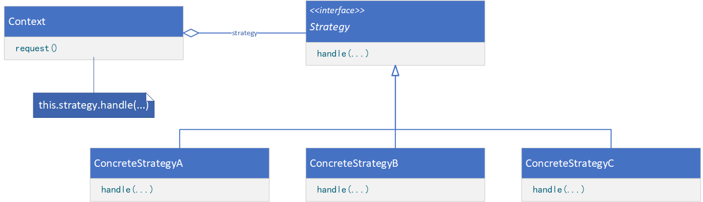

**STRATEGY（策略）**

# 意图

定义一系列的算法，把它们一个个封装起来，并且使它们可相互替换。本模式使得算法可独立于使用它的客户而变化。

# 别名

政策（Policy）

# 适用性

在以下情况时使用Strategy模式：

* 许多相关的类仅仅是行为有异。“策略”提供了一种用多个行为中的一个行为来配置一个类的方法。
* 需要使用一个算法的不同变体。例如，你可能会定义一些反映不同的空间/时间权衡的算法。当这些变体实现为一个算法的类层次时，可以使用策略模式。
* 算法使用客户不应该知道的数据。可使用策略模式以避免暴露复杂的、与算法相关的数据结构。
* 一个类定义了多种行为，并且这些行为在这个类的操作中以多个条件语句的形式出现。将相关的条件分支移入它们各自的Strategy类中以代替这些条件语句。

# 结构



# 参与者

* Strategy（策略，如Compositor）
    * 定义所有支持的算法的公共接口。Context使用这个接口来调用某ConcreteStrategy定义的算法。
* ConcreteStrategy（具体策略，如SimpleCompositor、TeXCompositor、ArrayCompositor）
    * 以Strategy接口实现某具体算法。
* Context（上下文，如Composition）
    * 用一个ConcreteStrategy对象来配置。
    * 维护一个对Strategy对象的引用。
    * 可定义一个接口来让Strategy访问它的数据。

# 协作

* Strategy和Context相互作用以实现选定的算法。当算法被调用时，Context可以将该算法所需要的所有数据都传递给该Strategy。或者，Context可以将自身作为一个参数传递给Strategy操作。这就让Strategy在需要时可以回调Context。
* Context将客户的请求转发给它的Strategy。客户通常创建并传递一个ConcreteStrategy对象给该Context，这样，客户仅与Context交互。通常有一系列的ConcreteStrategy类可供客户从中选择。

# 代码示例

```java
public interface Strategy {
    void handle(String data);
}
```

```java
public class ConcreteStrategy implements Strategy {
    @Override
    public void handle(String data) {
        // provide processing logic
    }
}
```

```java
public class Context {
    private Strategy strategy;

    private String data;

    public Context(Strategy strategy, String data) {
        this.strategy = strategy;
        this.data = data;
    }

    public void request() {
        this.strategy.handle(this.data);
    }

    public void setStrategy(Strategy strategy) {
        this.strategy = strategy;
    }
}
```

```java
public class Client {
    public static void main(String[] args) {
        ConcreteStrategy strategyA = new ConcreteStrategy();
        ConcreteStrategy strategyB = new ConcreteStrategy();
        ConcreteStrategy strategyC = new ConcreteStrategy();
        Context context = new Context(strategyA, "Data");
        context.request();
        context.setStrategy(strategyB);
        context.request();
        context.setStrategy(strategyC);
        context.request();
    }
}
```
