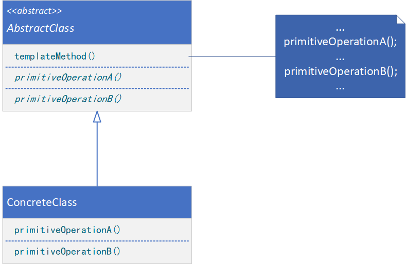

**TEMPLATE METHOD（模板方法）**

# 意图

定义一个操作中的算法的骨架，而将一些步骤延迟到子类中。TemplateMethod使得子类可以不改变一个算法的结构即可重定义该算法的某些特定步骤。

# 适用性

模板方法适用于下列情况：

* 一次性实现一个算法的不变的部分，并将可变得行为留给子类来实现。
* 各子类中公共的行为应被提取出来并集中到一个公共父类中以避免代码重复。这是Opdyke和Johnson所描述过的“重分解以一般化”的一个很好的例子。首先识别现有代码中的不同之处，并且将不同之处分离为新的操作。最后，用一个调用新的操作的模板方法来替换不同的代码。
* 控制子类扩展。模板方法只在特定点调用钩子（Hook）操作，这样就只允许在这些点进行扩展。

# 结构



# 参与者

* AbstractClass（抽象类，如Application）
    * 定义抽象的原语操作（Primitive Operation），具体的子类将重定义它们以实现一个算法的各步骤。
    * 实现一个模板方法，定义一个算法的骨架。该模板方法不仅调用原语操作，也调用定义在AbstractClass或其他对象中的操作。
* ConcreteClass（具体类，如MyApplication）
    * 实现原语操作以完成算法中与特定子类相关的步骤。

# 协作

* ConcreteClass靠AbstractClass来实现算法中不变的步骤。

# 代码示例

```java
public abstract class AbstractClass {
    public void templateMethod() {
        // provide fixed algorithm logic
        primitiveOperationA();
        // provide fixed algorithm logic
        primitiveOperationB();
        // provide fixed algorithm logic
    }

    protected abstract void primitiveOperationA();

    protected abstract void primitiveOperationB();
}
```

```java
public class ConcreteClass extends AbstractClass {
    @Override
    protected void primitiveOperationA() {
        // provide variable algorithm logic
    }

    @Override
    protected void primitiveOperationB() {
        // provide variable algorithm logic
    }
}
```

```java
public class Client {
    public static void main(String[] args) {
        AbstractClass templateClass = new ConcreteClass();
        templateClass.templateMethod();
    }
}
```
