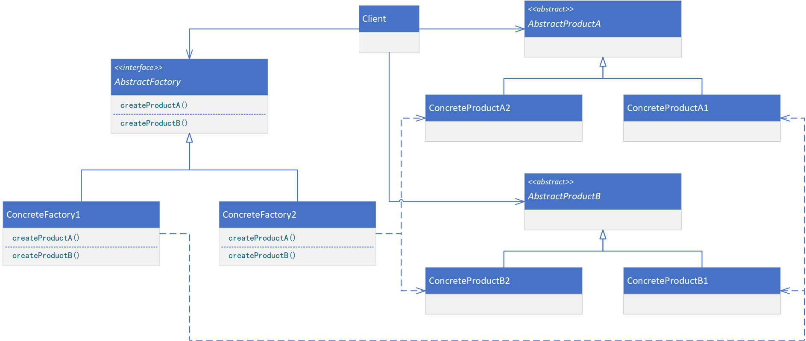

**ABSTRACT FACTORY（抽象工厂）**

# 意图

提供一个接口以创建一系列相关或相互依赖的对象，而无须指定它们具体的类。

# 别名

Kit

# 适用性

在以下情况时使用Abstract Factory模式：

* 一个系统要独立于它的产品的创建、组合和表示。
* 一个系统要由多个产品系列中的一个来配置。
* 要强调一系列相关的产品对象的设计以便进行联合使用。
* 提供一个产品类库，但只想显示它们的接口而不是实现。

# 结构

此模式的结构如下图所示。



# 参与者

* AbstractFactory（WidgetFactory）
    * 声明一个创建抽象产品对象的操作接口。
* ConcreteFactory（MotifWidgetFactory、PMWidgetFactory）
    * 实现创建具体产品对象的操作。
* AbstractProduct（Windows、ScrollBar）
    * 为一类产品对象声明一个接口。
* ConcreteProduct（MotifWindow，MotifScrollBar）
    * 定义一个将被相关的具体工厂创建的产品对象。
    * 实现AbstractProduct接口。
* Client
    * 仅使用由AbstractFactory和AbstractProduct类声明的接口。

# 协作

* 通常在运行时创建一个ConcreteFactory类的实例。这一具体的工厂创建具有特定实现的产品对象。为创建不同的产品对象，客户应使用不同的具体工厂。
* AbstractFactory将产品对象的创建延迟到它的ConcreteFactory子类。

# 代码示例

```java
public abstract class AbstractProductA {
}
```

```java
public class ConcreteProductA1 extends AbstractProductA {
}
```

```java
public class ConcreteProductA2 extends AbstractProductA {
}
```

```java
public abstract class AbstractProductB {
}
```

```java
public class ConcreteProductB1 extends AbstractProductB {
}
```

```java
public class ConcreteProductB2 extends AbstractProductB {
}
```

```java
public interface AbstractFactory {
    AbstractProductA createProductA();

    AbstractProductB createProductB();
}
```

```java
public class ConcreteFactory1 implements AbstractFactory {
    private static ConcreteFactory1 INSTANCE = new ConcreteFactory1();

    public static ConcreteFactory1 getInstance() {
        return INSTANCE;
    }

    private ConcreteFactory1() {
        // singleton
    }

    @Override
    public AbstractProductA createProductA() {
        return new ConcreteProductA1();
    }

    @Override
    public AbstractProductB createProductB() {
        return new ConcreteProductB1();
    }
}
```

```java
public class ConcreteFactory2 implements AbstractFactory {
    private static ConcreteFactory2 INSTANCE = new ConcreteFactory2();

    public static ConcreteFactory2 getInstance() {
        return INSTANCE;
    }

    private ConcreteFactory2() {
        // singleton
    }

    @Override
    public AbstractProductA createProductA() {
        return new ConcreteProductA2();
    }

    @Override
    public AbstractProductB createProductB() {
        return new ConcreteProductB2();
    }
}
```

```java
public class Client {
    public static void main(String[] args) {
        AbstractFactory factory;
        AbstractProductA productA;
        AbstractProductB productB;

        factory = ConcreteFactory1.getInstance();
        productA = factory.createProductA();
        productB = factory.createProductB();

        factory = ConcreteFactory2.getInstance();
        productA = factory.createProductA();
        productB = factory.createProductB();
    }
}
```
