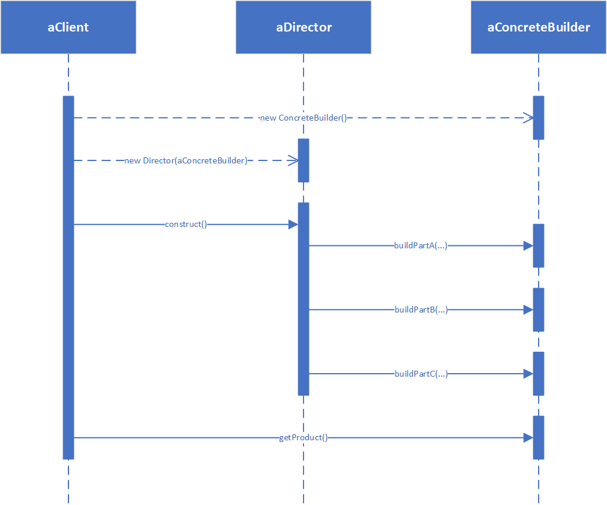

**BUILDER（生成器）**

# 意图

将一个复杂对象的构建与它的表示分离，使得同样的构建过程可以创建不同的表示。

# 适用性

在以下情况时使用Builder模式：

* 当创建复杂对象的算法应该独立于该对象的组成部分以及它们的装配方式时。
* 当构造过程必须允许被构造的对象有不同的表示时。

# 结构

此模式结构如下图所示。


# 参与者

* Builder（TextConverter）
    * 为创建一个Product对象的各个部件指定抽象接口。
* ConcreteBuilder（ASCIIConverter、TeXConverter、TextWidgetConverter）
    * 实现Builder的接口以构造和装配该产品的各个部件。
    * 定义并跟踪它所创建的表示。
    * 提供一个检索产品的接口（例如，GetASCIIText和GetTextWidget）。
* Director（RTFReader）
    * 构造一个使用Builder接口的对象。
* Product（ASCIIText、TeXText、TextWidget）
    * 表示被构造的复杂对象。ConcreteBuilder创建该产品的内部表示并定义它的装配过程。
    * 包含定义组成部件的类，包括将这些部件装配成最终产品的接口。

# 协作

* 客户创建Director对象，并用它所想要的Builder对象进行配置。
* 一旦生成了产品部件，导向器就会通知生成器。
* 生成器处理导向器的请求，并将部件添加到该产品中。
* 客户从生成器中检索产品。

下面的交互图说明了Builder和Director是如何与一个客户协作的。



# 代码示例

```java
public class Product {
    private String data;

    public String getData() {
        return data;
    }

    public void setData(String data) {
        this.data = data;
    }
}
```

```java
public interface Builder {
    void buildPart(String data);

    Product getProduct();
}
```

```java
public class ConcreteBuilder implements Builder {
    private Product product;

    public ConcreteBuilder() {
        this.product = new Product();
    }

    @Override
    public void buildPart(String data) {
        this.product.setData(data);
    }

    @Override
    public Product getProduct() {
        return this.product;
    }
}
```

```java
public class Director {
    private Builder builder;

    public Director(Builder builder) {
        this.builder = builder;
    }

    public void construct() {
        // provide processing logic
        this.builder.buildPart("Data");
        // provide processing logic
    }
}
```

```java
public class Client {
    public static void main(String[] args) {
        ConcreteBuilder builder = new ConcreteBuilder();
        Director director = new Director(builder);
        director.construct();
        Product product = builder.getProduct();
    }
}
```
