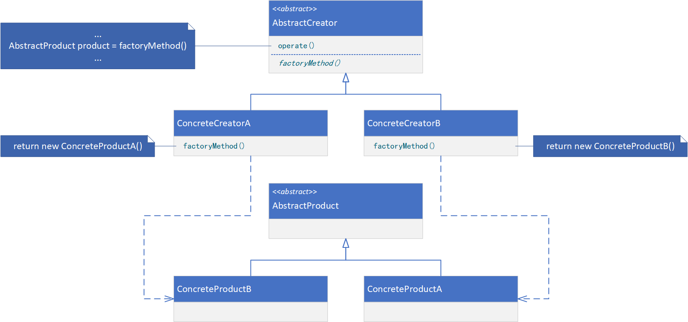

**FACTORY METHOD（工厂方法）**

# 意图

定义一个用于创建对象的接口，让子类决定实例化哪一个类。Factory Method使一个类的实例化延迟到其子类。

# 别名

虚构造器（Virtual Constructor）

# 适用性

在以下情况时可以使用Factory Method模式：

* 当一个类不知道它所必须创建的对象的类的时候。
* 当一个类希望由它的子类来指定它所创建的对象的时候。
* 当类将创建对象的职责委托给多个帮助子类中的某一个，并且你希望将哪一个帮助子类是代理者这一信息局部化的时候。

# 结构



# 参与者

* AbstractProduct（Document）
    * 定义工厂方法所创建的对象的接口。
* ConcreteProduct（MyDocument）
    * 实现AbstractProduct接口。
* AbstractCreator（Application）
    * 声明工厂方法，该方法返回一个AbstractProduct类型的对象。AbstractCreator也可以定义一个工厂方法的缺省实现，它返回一个缺省的ConcreteProduct对象。
    * 可以调用工厂方法以创建一个AbstractProduct对象。
* ConcreteCreator（MyApplication）
    * 重定义工厂方法以返回一个ConcreteProduct实例。

# 协作

* AbstractCreator依赖于它的子类来定义工厂方法，所以它返回一个适当的ConcreteProduct实例。

# 代码示例

```java
public abstract class AbstractProduct {
}
```

```java
public class ConcreteProduct extends AbstractProduct {
}
```

```java
public abstract class AbstractCreator {
    public void operate() {
        // provide processing logic
        AbstractProduct product = factoryMethod();
        // provide processing logic
    }

    protected abstract AbstractProduct factoryMethod();
}
```

```java
public class ConcreteCreator extends AbstractCreator {
    @Override
    protected AbstractProduct factoryMethod() {
        return new ConcreteProduct();
    }
}
```

```java
public class Client {
    public static void main(String[] args) {
        AbstractCreator creator = new ConcreteCreator();
        creator.operate();
    }
}
```
