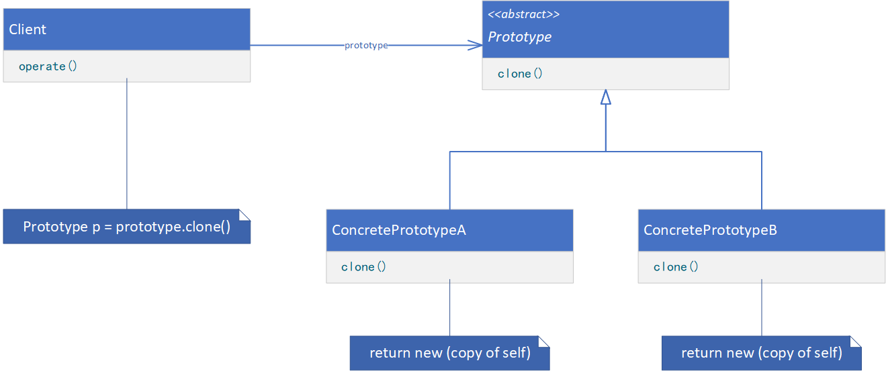

**PROTOTYPE（原型）**

# 意图

用原型实例指定创建对象的种类，并且通过拷贝这些原型创建新的对象。

# 适用性

在以下情况时使用Prototype模式：

* 当一个系统应该独立于它的产品创建、构成和表示时。
* 当要实例化的类是在运行时指定时，例如，通过动态装载。
* 为了避免创建一个与产品类层次平行的工厂类层次时。
* 当一个类的实例只能有几个不同状态组合中的一种时。建立相应数目的原型并克隆它们可能比每次用合适的状态手工实例化该类更方便一些。

# 结构



# 参与者

* Prototype（Graphic）
    * 声明一个克隆自身的接口。
* ConcretePrototype（Staff、WholeNote、HalfNote）
    * 实现一个克隆自身的操作。
* Client（GraphicTool）
    * 让一个原型克隆自身从而创建一个新的对象。

# 协作

* 客户请求一个原型克隆自身。

# 代码示例

```java
public abstract class Prototype {
    abstract Prototype clone(boolean isDeep);
}
```

```java
public class ConcretePrototype extends Prototype {
    private String state;

    public String getState() {
        return this.state;
    }

    public void setState(String state) {
        this.state = state;
    }

    @Override
    Prototype clone(boolean isDeep) {
        ConcretePrototype self = new ConcretePrototype();
        self.setState(this.state);
        return self;
    }
}
```

```java
public class Client {
    public static void main(String[] args) {
        ConcretePrototype prototype = new ConcretePrototype();

        // provide processing logic
        prototype.setState("StateA");
        Prototype prototypeCloneA = prototype.clone(false);

        // provide processing logic
        prototype.setState("StateB");
        Prototype prototypeCloneB = prototype.clone(false);
    }
}
```
