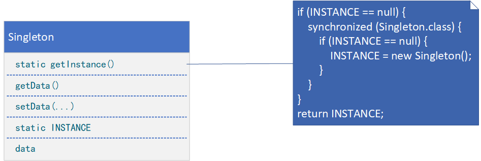

**SINGLETON（单件）**

# 意图

保证一个类仅有一个实例，并提供一个访问它的全局访问点。

# 适用性

在下面的情况时可以使用Singleton模式：

* 当类只能有一个实例而且客户可以从一个众所周知的访问点访问它时。
* 当这个唯一实例应该是通过子类化可扩展的，并且客户应该无须更改代码就能使用一个扩展的实例时。

# 结构



# 参与者

* Singleton
    * 定义一个Instance操作，允许客户访问它的唯一实例。Instance是一个类操作（即Smalltalk中的一个类方法和C++中的一个静态成员函数）。
    * 可能负责创建它自己的唯一实例。

# 协作

* 客户只能通过Singleton的Instance操作访问一个Singleton的实例。

# 代码示例

```java
public class Singleton {
    private static class SingletonHolder {
        private static final Singleton INSTANCE = new Singleton();
    }

    public static Singleton getInstance() {
        return SingletonHolder.INSTANCE;
    }

    private String data;

    private Singleton() {
        // singleton
    }

    public String getData() {
        return this.data;
    }

    public void setData(String data) {
        this.data = data;
    }
}
```

```java
public enum SingletonEnum {
    SINGLETON;

    public void operate() {
        // provide processing logic
    }
}
```

```java
public class Client {
    public static void main(String[] args) {
        Singleton singleton = Singleton.getInstance();
        singleton.setData("Data");
        SingletonEnum.SINGLETON.operate();
    }
}
```
