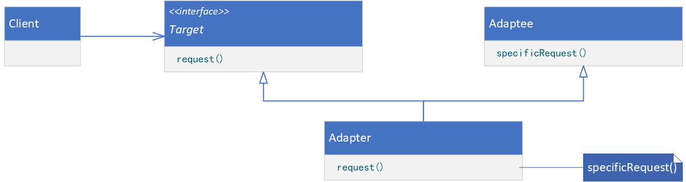
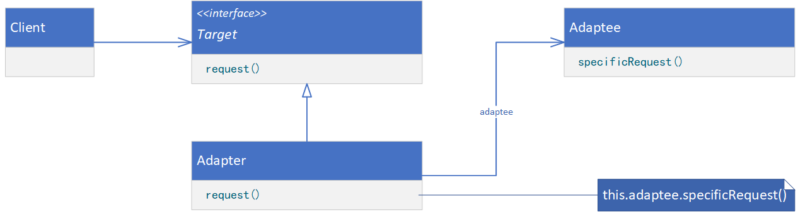

**ADAPTER（适配器）**

# 意图

将一个类的接口转换成客户希望的另外一个接口。Adapter模式使得原本由于接口不兼容而不能一起工作的那些类可以一起工作。

# 别名

包装器（Wrapper）

# 适用性

以下一些情况使用Adapter模式：

* 你想使用一个已经存在的类，而它的接口不符合你的需求。
* 你想创建一个可以复用的类，该类可以与其他不相关的类或不可预见的类（即那些接口可能不一定兼容的类）协同工作。
* （仅适用于对象Adapter）你想使用一些已经存在的子类，但是不可能对每一个都进行子类化以匹配它们的接口。对象适配器可以适配它的父类接口。

# 结构

类适配器使用多重继承对一个接口与另一个接口进行匹配，如下图所示。



对象匹配器依赖于对象组合，如下图所示。



# 参与者

* Target（Shape）
    * 定义Client使用的与特定领域相关的接口。
* Client（DrawingEditor）
    * 与符合Target接口的对象协同。
* Adaptee（TextView）
    * 定义一个已经存在的接口，这个接口需要适配。
* Adapter（TextShape）
    * 对Adaptee的接口与Target接口进行适配。

# 协作

* Client在Adapter实例上调用一些操作。接着适配器调用Adaptee的操作实现这个请求。

# 代码示例

```java
public class Adaptee {
    public void specificRequest() {
        // provide processing logic
    }
}
```

```java
public interface Target {
    void request();
}
```

```java
public class AdapterViaClass extends Adaptee implements Target {
    @Override
    public void request() {
        specificRequest();
    }
}
```

```java
public class AdapterViaObject implements Target {
    private Adaptee adaptee;

    public AdapterViaObject(Adaptee adaptee) {
        this.adaptee = adaptee;
    }

    @Override
    public void request() {
        this.adaptee.specificRequest();
    }
}
```

```java
public class Client {
    public static void main(String[] args) {
        Target targetViaClass = new AdapterViaClass();
        targetViaClass.request();
        Target targetViaObject = new AdapterViaObject(new Adaptee());
        targetViaObject.request();
    }
}
```
