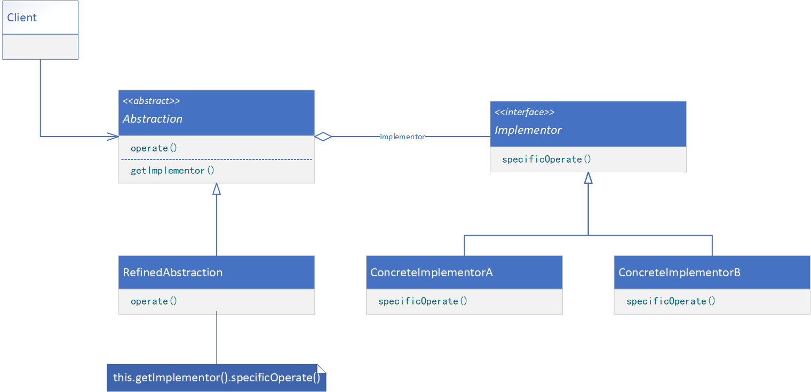

**BRIDGE（桥接）**

# 意图

将抽象部分与它的实现部分分离，使它们都可以独立地变化。

# 别名

Handle/Body

# 适用性

以下一些情况使用Bridge模式：

* 你不希望在抽象和它的实现部分之间有一个固定的绑定关系。例如，这种情况可能是因为，在程序运行时实现部分应可以被选择或者切换。
* 类的抽象以及它的实现都应该可以通过生成子类的方法加以扩充。这时Bridge模式使你可以对不同的抽象接口和实现部分进行组合，并分别对它们进行扩充。
* 对一个抽象的实现部分的修改应对客户不产生影响，即客户的代码不必重新编译。
* （C++）你想对客户完全隐藏抽象的实现部分。在C++中，类的表示在类接口中是可见的。
* 正如在意图一节的第一个类图中所示的那样，有许多类要生成。这样一种类层次结构说明你必须将一个对象分解成两个部分。Rumbaugh称这种类层次结构为“嵌套的泛化”（Nested Generalizations）。
* 你想在多个对象间共享实现（可能使用引用计数），但同时要求客户并不知道这一点。一个简单的例子便是Coplien的String类，在这个类中多个对象可以共享同一个字符串表示（StringRep）。

# 结构



# 参与者

* Abstraction（Window）
    * 定义抽象类的接口
    * 维护一个指向Implementor类型对象的指针。
* RefinedAbstraction（IconWindow）
    * 扩充由Abstraction定义的接口。
* Implementor（WindowImp）
    * 定义实现类的接口，该接口不一定要与Abstraction的接口完全一致；事实上这两个接口可以完全不同。一般来讲，Implementor接口仅提供基本操作，而Abstraction则定义了基于这些基本操作的较高层次的操作。
* ConcreteImplementor（XWindowImp、PMWindowImp）
    * 实现Implementor接口并定义它的具体实现。

# 协作

* Abstraction将Client的请求转发给它的Implementor对象。

# 代码示例

```java
public abstract class Abstraction {
    protected Implementor implementor;

    protected abstract Implementor getImplementor();

    public abstract void operate();
}
```

```java
public class RefinedAbstraction extends Abstraction {
    public RefinedAbstraction(Implementor implementor) {
        this.implementor = implementor;
    }

    @Override
    protected Implementor getImplementor() {
        return this.implementor;
    }

    @Override
    public void operate() {
        // provide processing logic
        this.implementor.specificOperate();
    }
}
```

```java
public interface Implementor {
    void specificOperate();
}
```

```java
public class ConcreteImplementor implements Implementor {
    @Override
    public void specificOperate() {
        // provide processing logic
    }
}
```

```java
public class Client {
    public static void main(String[] args) {
        Abstraction abstraction = new RefinedAbstraction(new ConcreteImplementor());
        abstraction.operate();
    }
}
```
