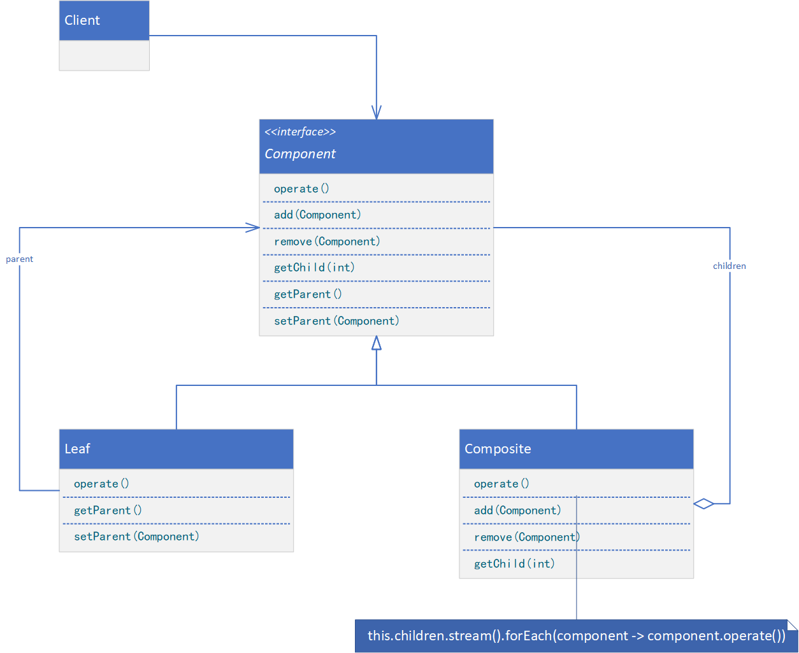

**COMPOSITE（组合）**

# 意图

将对象组合成树形结构以表示“部分-整体”的层次结构。Composite使得用户对单个对象和组合对象的使用具有一致性。

# 适用性

以下情况使用Composite模式：

* 你想表示对象的部分-整体层次结构。
* 你希望用户忽略组合对象与单个对象的不同，用户将统一地使用组合结构中的所有对象。

# 结构



典型的Composite对象结构如下图所示。


# 参与者

* Component（Graphic）
    * 为组合中的对象声明接口。
    * 在适当的情况下，实现所有类共有接口的缺省行为。
    * 声明一个接口用于访问和管理Component的子组件。
    * （可选）在递归结构中定义一个接口，用于访问一个父部件，并在合适的情况下实现它。
* Leaf（Rectangle、Line、Text等）
    * 在组合中表示叶结点对象，叶结点没有子结点。
    * 在组合中定义图元对象的行为。
* Composite（Picture）
    * 定义有子部件的那些部件的行为。
    * 存储子部件。
    * 在Component接口中实现与子部件有关的操作。
* Client
    * 通过Component接口操纵组合部件的对象。

# 协作

* 用户使用Component类接口与组合结构中的对象进行交互。如果接收者是一个叶结点，则直接处理请求。如果接收者是Composite，它通常将请求发送给它的子部件，在转发请求之前和/或之后可能执行一些辅助操作。

# 代码示例

```java
public interface Component {
    void operate();

    default void add(Component component) {
        // default
    }

    default void remove(Component component) {
        // default
    }

    default Component getChild(int index) {
        // default
        return null;
    }

    default Component getParent() {
        // default
        return null;
    }

    default void setParent(Component parent) {
        // default
    }
}
```

```java
public class Leaf implements Component {
    private Component parent;

    @Override
    public void operate() {
        // provide processing logic
    }

    @Override
    public Component getParent() {
        return this.parent;
    }

    @Override
    public void setParent(Component parent) {
        this.parent = parent;
    }
}
```

```java
public class Composite implements Component {
    private List<Component> children;

    public Composite() {
        this.children = new LinkedList<>();
    }

    @Override
    public void operate() {
        // provide processing logic
        this.children.stream().forEach(component -> component.operate());
    }

    @Override
    public void add(Component component) {
        component.setParent(this);
        this.children.add(component);
    }

    @Override
    public void remove(Component component) {
        this.children.remove(component);
        component.setParent(null);
    }

    @Override
    public Component getChild(int index) {
        return this.children.get(index);
    }
}
```

```java
public class Client {
    public static void main(String[] args) {
        Composite compositeA = new Composite();
        Composite compositeB = new Composite();
        Leaf leafA = new Leaf();
        Leaf leafB = new Leaf();
        Leaf leafC = new Leaf();
        compositeB.add(leafB);
        compositeB.add(leafC);
        compositeA.add(leafA);
        compositeA.add(compositeB);
        Component root = compositeA;
        root.operate();
    }
}
```
