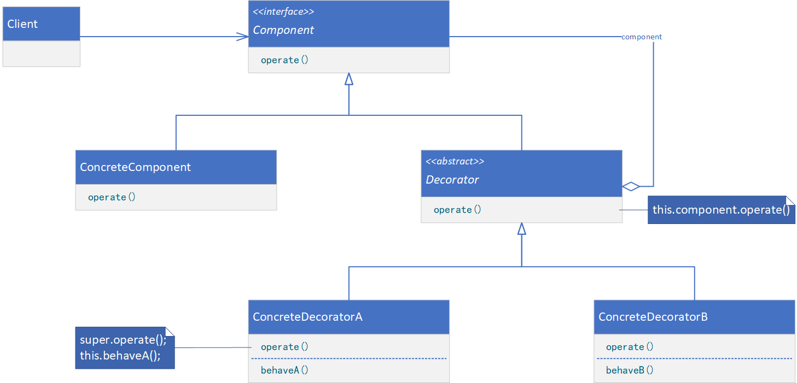

**DECORATOR（装饰）**

# 意图

动态地给一个对象添加一些额外的职责。就增加功能来说，Decorator模式相比生成子类更为灵活。

# 别名

包装器（Wrapper）

# 适用性

以下情况使用Decorator模式：

* 在不影响其他对象的情况下，以动态、透明的方式给单个对象添加职责。
* 处理那些可以撤销的职责。
* 当不能采用生成子类的方法进行扩充时。一种情况是，可能有大量独立的扩展，为支持每一种组合将产生大量的子类，使得子类数目呈爆炸性增长。另一种情况可能是，类定义被隐藏，或类定义不能用于生成子类。

# 结构



# 参与者

* Component（VisualComponent）
    * 定义一个对象接口，可以给这些对象动态地添加职责。
* ConcreteComponent（TextView）
    * 定义一个对象，可以给这个对象添加一些职责。
* Decorator
    * 维护一个指向Component对象的指针，并定义一个与Component接口一致的接口。
* ConcreteDecorator（BorderDecorator、ScrollDecorator）
    * 向组件添加职责。

# 协作

* Decorator将请求转发给它的Component对象，并有可能在转发请求前后执行一些附加的动作。

# 代码示例

```java
public interface Component {
    void operate();
}
```

```java
public class ConcreteComponent implements Component {
    @Override
    public void operate() {
        // provide processing logic
    }
}
```

```java
public abstract class Decorator implements Component {
    private Component component;

    public Decorator(Component component) {
        this.component = component;
    }

    @Override
    public void operate() {
        // provide processing logic
        this.component.operate();
    }
}
```

```java
public class ConcreteDecorator extends Decorator {
    public ConcreteDecorator(Component component) {
        super(component);
    }

    @Override
    public void operate() {
        this.behave();
        super.operate();
    }

    private void behave() {
        // provide processing logic
    }
}
```

```java
public class Client {
    public static void main(String[] args) {
        Component component = new ConcreteComponent();
        component = new ConcreteDecoratorA(component);
        component = new ConcreteDecoratorB(component);
        component.operate();
    }
}
```
