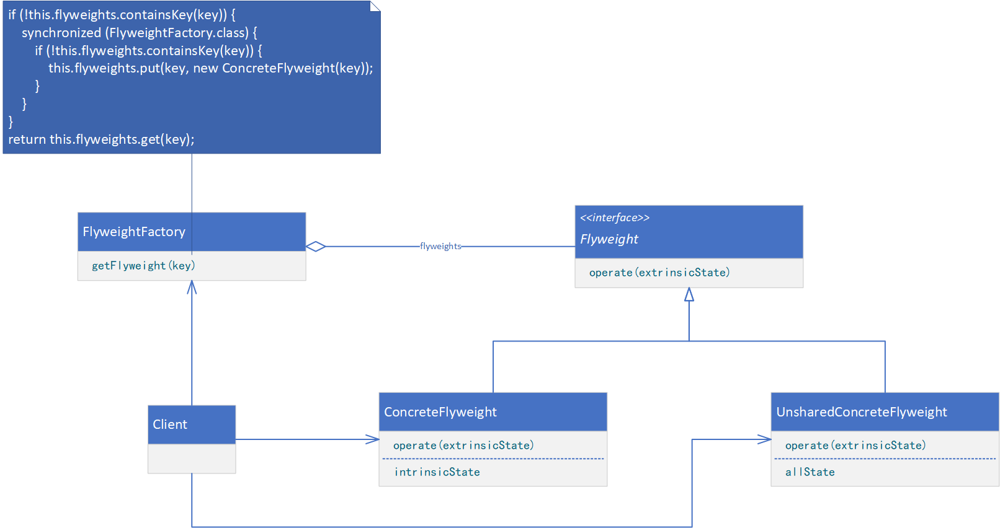
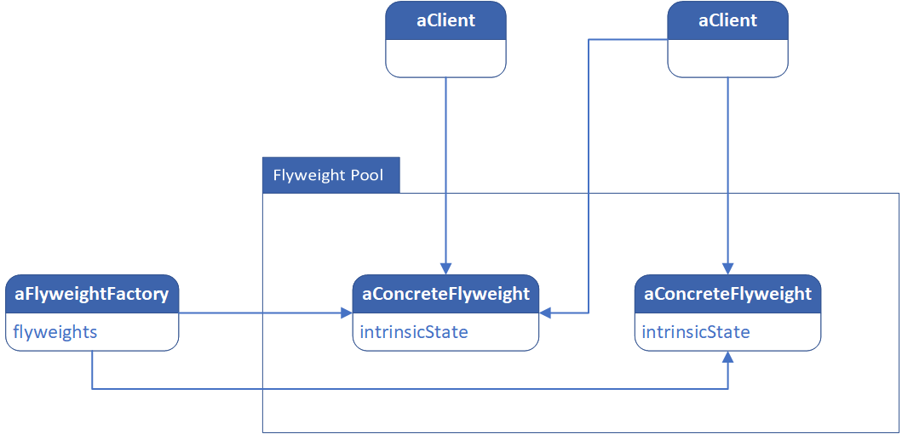

**FLYWEIGHT（享元）**

# 意图

运用共享技术有效地支持大量细粒度的对象。

# 适用性

Flyweight模式的有效性很大程度上取决于如何使用它以及在何处使用它。当以下情况都成立时使用Flyweight模式：

* 一个应用程序使用了大量的对象。
* 完全由于使用大量的对象造成很大的存储开销。
* 对象的大多数状态都可变为外部状态。
* 如果删除对象的外部状态，那么可以用相对较少的共享对象取代很多组对象。
* 应用程序不依赖于对象标识。由于Flyweight对象可以被共享，因此对于概念上明显有别的对象，标识测试将返回真值。

# 结构



下面的对象图说明了如何共享Flyweight。



# 参与者

* Flyweight（Glyph）
    * 描述一个接口，通过这个接口Flyweight可以接受并作用于外部状态。
* ConcreteFlyweight（Character）
    * 实现Flyweight接口，并为内部状态（如果有的话）增加存储空间。ConcreteFlyweight对象必须是可共享的。它所存储的状态必须是内部的；即它必须独立于ConcreteFlyweight对象的场景。
* UnsharedConcreteFlyweight（Row、Column）
    * 并非所有的Flyweight子类都需要被共享。Flyweight接口使共享成为可能，但它并不强制共享。在Flyweight对象结构的某些层次，UnsharedConcreteFlyweight对象通常将ConcreteFlyweight对象作为子结点（Row和Column就是这样）。
* FlyweightFactory
    * 创建并管理Flyweight对象。
    * 确保合理地共享Flyweight。当用户请求一个Flyweight时，FlyweightFactory对象提供一个已创建的实例或者创建一个（如果不存在的话）。
* Client
    * 维持一个对Flyweight的引用。
    * 计算或存储一个（多个）Flyweight的外部状态。

# 协作

* Flyweight执行时所需的状态必定是内部的或外部的。内部状态存储于ConcreteFlyweight对象之中；而外部对象则由Client对象存储或计算。当用户调用Flyweight对象的操作时，将该状态传递给它。
* 用户不应该直接对ConcreteFlyweight类进行实例化，而只能从FlyweightFactory对象得到ConcreteFlyweight对象，这可以保证对它们适当地进行共享。

# 代码示例

```java
public interface Flyweight {
    void operate(String extrinsicState);
}
```

```java
public class ConcreteFlyweight implements Flyweight {
    private String intrinsicState;

    public ConcreteFlyweight(String intrinsicState) {
        this.intrinsicState = intrinsicState;
    }

    @Override
    public void operate(String extrinsicState) {
        // provide processing logic
    }
}
```

```java
public class UnsharedConcreteFlyweight implements Flyweight {
    private String allState;

    public UnsharedConcreteFlyweight(String allState) {
        this.allState = allState;
    }

    @Override
    public void operate(String extrinsicState) {
        // provide processing logic
    }
}
```

```java
public class FlyweightFactory {
    private static final Set<String> SHARED_KEYS = new HashSet<>();

    static {
        SHARED_KEYS.add("A");
        SHARED_KEYS.add("B");
        SHARED_KEYS.add("C");
    }

    private Map<String, Flyweight> flyweights;

    private FlyweightFactory() {
        this.flyweights = new LinkedHashMap<>();
    }

    public Flyweight getFlyweight(String key) {
        if (SHARED_KEYS.contains(key)) {
            if (!this.flyweights.containsKey(key)) {
                synchronized (FlyweightFactory.class) {
                    if (!this.flyweights.containsKey(key)) {
                        this.flyweights.put(key, new ConcreteFlyweight(key));
                    }
                }
            }
            return this.flyweights.get(key);
        } else {
            return new UnsharedConcreteFlyweight(key);
        }
    }
}
```

```java
public class Client {
    public static void main(String[] args) {
        FlyweightFactory flyweightFactory = new FlyweightFactory();
        Flyweight flyweightA1 = flyweightFactory.getFlyweight("A");
        Flyweight flyweightA2 = flyweightFactory.getFlyweight("A");
        Flyweight flyweightB = flyweightFactory.getFlyweight("B");
        Flyweight flyweightC = flyweightFactory.getFlyweight("C");
        Flyweight flyweightOther = flyweightFactory.getFlyweight("Other");
        flyweightA1.operate("1.1");
        flyweightA2.operate("1.2");
        flyweightB.operate("2");
        flyweightC.operate("3");
        flyweightOther.operate("9");
    }
}
```
