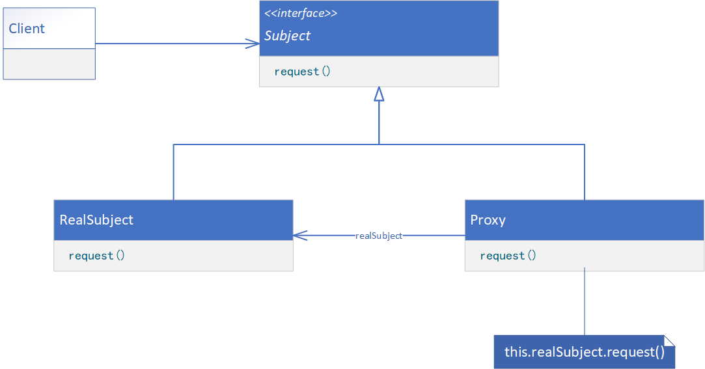
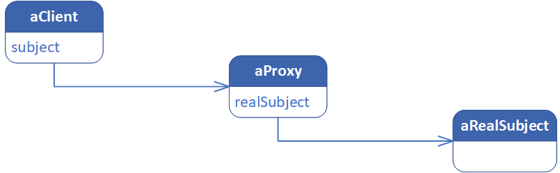

**PROXY（代理）**

# 意图

为其他对象提供一种代理以控制对这个对象的访问。

# 别名

Surrogate

# 适用性

在需要用比较通用和复杂的对象指针代替简单的指针的时候，使用Proxy模式。下面是一些可以使用Proxy模式的常见情况：

1. 远程代理（Remote Proxy）为一个对象在不同的地址空间提供局部代表。NEXTSTEP使用NXProxy类实现了这一目的。Coplien称这种代理为“大使”（Ambassador）。
1. 虚代理（Virtual Proxy）根据需要创建开销很大的对象。在动机一节描述的ImageProxy就是这样一种代理的例子。
1. 保护代理（Protection Proxy）控制对原始对象的访问。保护代理用于对象应该有不同的访问权限的时候。例如，在Choices操作系统中KernelProxies为操作系统对象提供了访问保护。
1. 智能指引（Smart Reference）取代了简单的指针，它在访问对象时执行一些附加操作。它的典型用途包括：
    * 对指向实际对象的引用计数，这样当该对象没有引用时，可以自动释放它（也称为Smart Pointer）。
    * 当第一次引用一个持久对象时，将它装入内存。
    * 在访问一个实际对象前，检查是否已经锁定了它，以确保其他对象不能改变它。

# 结构



这是运行时刻一种可能的代理结构的对象图。



# 参与者

* Proxy（ImageProxy）
    * 保存一个引用使得代理可以访问实体。若RealSubject和Subject的接口相同，Proxy会引用Subject。
    * 提供一个与Subject的接口相同的接口，这样代理就可以用来替代实体。
    * 控制对实体的存取，并可能负责创建和删除它。
    * 其他功能依赖于代理的类型：
        * 远程代理（Remote Proxy）负责对请求及其参数进行编码，并向不同地址空间中的实体发送已编码的请求。
        * 虚代理（Virtual Proxy）可以缓存实体的附加信息，以便延迟对它的访问。例如，动机一节中提到的ImageProxy缓存了图像实体的尺寸。
        * 保护代理（Protection Proxy）检查调用者是否具有实现一个请求所必需的访问权限。
* Subject（Graphic）
    * 定义RealSubject和Proxy的共用接口，这样就在任何使用RealSubject的地方都可以使用Proxy。
* RealSubject（Image）
    * 定义Proxy所代表的实体。

# 协作

* 代理根据其种类，在适当的时候向RealSubject转发请求。

# 代码示例

```java
public interface Subject {
    void request();
}
```

```java
public class RealSubject implements Subject {
    @Override
    public void request() {
        // provide processing logic
    }
}
```

```java
public class Proxy implements Subject {
    private RealSubject realSubject;

    public Proxy(RealSubject realSubject) {
        this.realSubject = realSubject;
    }

    @Override
    public void request() {
        // provide processing logic
        this.realSubject.request();
    }
}
```

```java
public class Client {
    public static void main(String[] args) {
        RealSubject realSubject = new RealSubject();
        Subject subject = new Proxy(realSubject);
        subject.request();
    }
}
```
